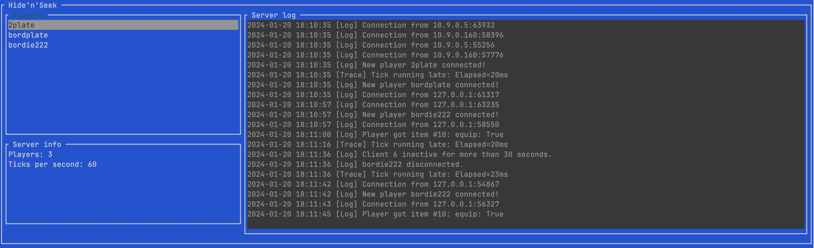

# Lawrence
Lawrence is a Lua scriptable game server for the [Ratchet & Clank 1 Multiplayer mod](https://github.com/bordplate/rac1-multiplayer).



## Installation
Download the latest release from the releases page and extract it to a directory of your choice. Run the "Lawrence" executable to start the server and follow the configuration wizard.

## Configuration
When you start Lawrence for the first time, it'll start out with a configuration wizard that lets you configure which mods to activate, and other settings.
At least 1 mod must be active for the server to do anything. Multiple mods can be active at the same time as long as they don't conflict with each other.

## Advertising
Lawrence can advertise itself to a directory server. This is useful if you want to make your server public. The directory server is a simple server that keeps track of all the servers that are currently running. 
To allow people to connect to a publicly advertised server, you must make sure that you've opened the port that the server is running on in your firewall.

### Configuration file
The configuration file is located at `./settings.toml`. It's a [TOML](https://toml.io/en/) file that you can edit manually if you want to change the configuration after the wizard has run.

Example configuration:
```toml

[Server]
name = "My Server"  # Name of the server as presented in the directory server 
port = 2407  # Port that the server listens on, default is 2407
max_players = 20  # Maximum number of players that can be connected to the server at the same time
address = "0.0.0.0"  # Address that the server listens on, default is 0.0.0.0
advertise = true  # Whether the server should advertise itself to the directory server
description = """
This is a test server for coop mode. This is test text for the description of the test serer for coop mode.
"""  # Description of the server as presented in the directory server
owner = "bordplate"  # Owner of the server as presented in the directory server

[Logger]
path = "lawrence.log"

[Mod]
# Mods are populated here based on the mods that are available in the mods directory, using the name of the directory as the key.
[Mod.tag]
enabled = true

[Mod.sandbox]
enabled = false
```